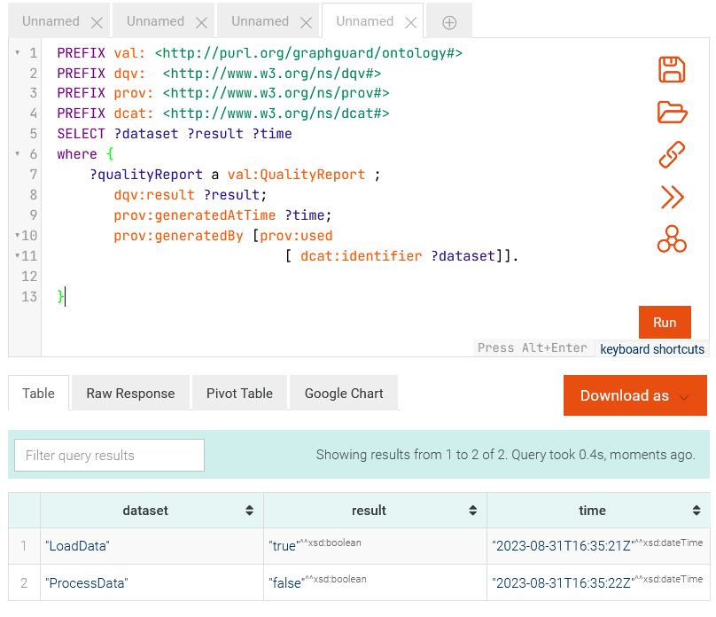

# Guardians
This project contains the source code for an software agent that validates different validation methods from different frameworks. Currently it is able to validate tabular data with the frictionless schema, validate data with abritrary python code (that implements a single function), and SHACL-rules. Guaridans generate automatic reports about the validation results and sends them to a defined knowledge graph. 

## Requirements
This project was developed with Python 3.9 and  uses [Poetry](https://python-poetry.org/) for dependency management.

## Installation
Download the zip file. The zip file includes a copy of all relevant files of this anomynized repository.:
```shell
unzip guardian.zip
```
Install poetry:

For linux:
```shell
curl -sSL https://install.python-poetry.org | python3 -
```
For windows:
```shell
(Invoke-WebRequest -Uri https://install.python-poetry.org -UseBasicParsing).Content | py -
```

Install the guardian library:
```shell
cd /path/to/guardian
poetry shell
poetry install
```

## Usage
Start the knowledge graph system that already includes some QualityContracts with the following command:
```shell
 docker run -p 127.0.0.1:7200:7200 -v ./docker/data:/opt/graphdb/home --rm --name graphdb-guardian -t ontotext/graphdb:10.3.1
```

Run for example one of the given data sets for the test pipeline:
# Valid Data
```python
python ./pipeline_tasks.py MapData --task-param valid_example.csv --local-scheduler
```


# Invalid Data
```python
python ./pipeline_tasks.py MapData --task-param invalid_example.csv --local-scheduler
```


See the results in the script and for instance the reports in graphdb. Use for that the example repository and query the graph with:
```sparql
PREFIX val: <http://purl.org/graphguard/ontology#>
PREFIX dqv:  <http://www.w3.org/ns/dqv#> 
PREFIX prov: <http://www.w3.org/ns/prov#>
PREFIX dcat: <http://www.w3.org/ns/dcat#>
SELECT ?dataset ?result ?time 
where { 
    ?qualityReport a val:QualityReport ;
       dqv:result ?result;
       prov:generatedAtTime ?time;
       prov:generatedBy [prov:used 
            				[ dcat:identifier ?dataset]].

}
```



## Licence
[GNU Affero General Public License Version 3](https://www.gnu.org/licenses/agpl-3.0.en.html)